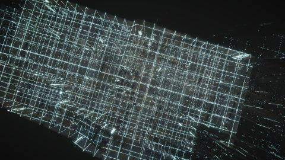

# Unity Point Cloud Example - Shibuya Underground

A little example of the point cloud visualization in Unity using [Pcx](https://github.com/keijiro/Pcx) and [Shibuya Underground 3D Data](https://3dcel.com/opendata/).



https://user-images.githubusercontent.com/3608128/133893989-b0aea005-dc4a-405f-8ce5-bcdef23e8969.mp4

## Requirements

- Unity >= 2021.1
- good PC, good graphics card

## How to run

1. Download the point cloud file (`.plt`) from [here](https://3dcel.com/opendata/).
2. Install the [CloudCompare](https://www.danielgm.net/cc/) and convert `.plt` file to `.ply`.

    ```powershell
    (base) PS F:\PointCloud\ShibuyaUnderground> & "C:\Program Files\CloudCompare\CloudCompare.exe" -O -GLOBAL_SHIFT AUTO .\ShibuyaUnderground.pts -C_EXPORT_FMT PLY -PLY_EXPORT_FMT BINARY_LE -DROP_GLOBAL_SHIFT -REMOVE_ALL_SFS -NO_TIMESTAMP -SAVE_CLOUDS
    ```

3. Put the `.ply` file into `/Assets/PointClound/ShibuyaUnderground.ply`.
4. Open this project directory in the Unity Editor and build/run it.

## License

### Point cloud data

- [渋谷地下3Dデータ](https://3dcel.com/opendata/)、©3D City Experience Lab.、[【表示4.0 国際】ライセンス](https://creativecommons.org/licenses/by/4.0/) を改変して作成
- Created by modifying [Shibuya Underground 3D Data](https://3dcel.com/opendata/)、©3D City Experience Lab.、[Licensed under the CC-BY 4.0](https://creativecommons.org/licenses/by/4.0/)

### Source code

- `CustomPcxPoint.shader` uses some code from [BA_PointCloud](https://github.com/SFraissTU/BA_PointCloud) that licensed under the [BSD 2-Clause License](https://github.com/SFraissTU/BA_PointCloud/blob/master/LICENSE). Copyright (c) 2017-2018, Simon Maximilian Fraiss All rights reserved.

Otherwise is under the MIT License.
